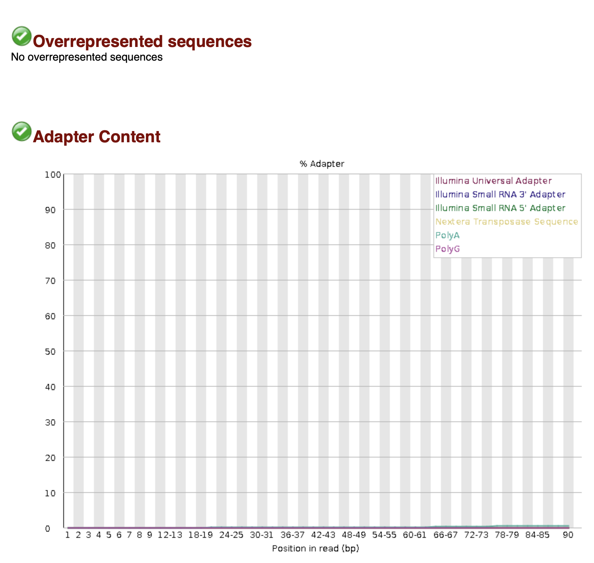
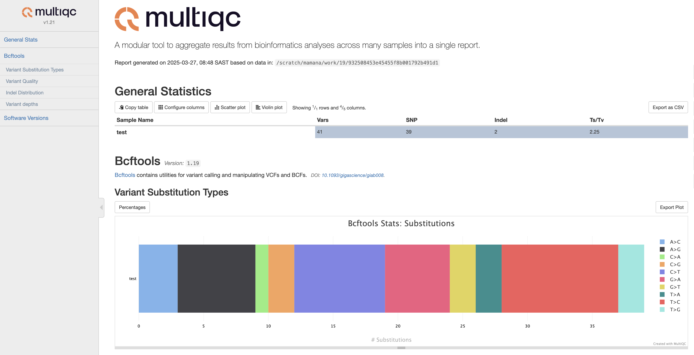

# VarCall DSL2 Pipeline Tutorial 2025

A comprehensive guide to running the VarCall DSL2 pipeline for variant calling, from setting up the environment to generating filtered VCF files.

## Introduction

Welcome to the VarCall DSL2 Pipeline Tutorial! This guide will walk you through the complete process of variant calling using the GATK best practices implemented in Nextflow. Whether you're new to bioinformatics or an experienced researcher, this tutorial provides step-by-step instructions to help you successfully analyze your sequencing data.

**What is Variant Calling?** Variant calling is the process of identifying differences between a sample genome and a reference genome. These differences, or variants, include single nucleotide polymorphisms (SNPs), insertions, deletions, and structural variants that may be associated with diseases, traits, or population diversity.

**Why Use a Pipeline?** Variant calling involves multiple complex steps that must be executed in the correct order with appropriate parameters. Using a well-designed pipeline like VarCall DSL2 ensures reproducibility, scalability, and adherence to best practices established by the bioinformatics community.

## How To Use This Tutorial

This tutorial is organized sequentially, following the natural workflow of variant calling:

1. **Setup Sections (1-2)**: Begin here to configure your environment and understand the pipeline structure
2. **Data Preparation (3-4)**: Learn how to prepare reference data and process input files
3. **Analysis Sections (5-6)**: Follow these core analysis steps for alignment and variant calling
4. **Advanced Usage (7-8)**: Explore these sections for customization and troubleshooting

**For First-Time Users**: We recommend reading through the entire tutorial before executing commands to understand the complete workflow. Then follow each section in order.

<!-- **For Experienced Users**: Jump directly to the [Quick Start Guide](#quick-start-guide) for a condensed workflow, or to specific sections as needed. -->

Throughout this tutorial, you'll find special callouts:

> **💡 Why This Matters**: Explains the importance of certain steps and concepts
>
> **⚠️ Common Pitfall**: Highlights frequent mistakes and how to avoid them
>
> **🔍 Pro Tip**: Offers advanced insights for experienced users

Let's begin your journey to successful variant calling!

## Table of Contents

- [VarCall DSL2 Pipeline Tutorial 2025](#varcall-dsl2-pipeline-tutorial-2025)
  - [Introduction](#introduction)
  - [How To Use This Tutorial](#how-to-use-this-tutorial)
  - [Table of Contents](#table-of-contents)
  - [Learning Objectives](#learning-objectives)
  - [Pipeline Summary](#pipeline-summary)
  - [1. Environment Setup](#1-environment-setup)
    - [1.1. Prerequisites](#11-prerequisites)
      - [Required Software](#required-software)
        - [Prerequisites:](#prerequisites)
        - [Install Nextflow:](#install-nextflow)
        - [Alternative installation methods:](#alternative-installation-methods)
      - [Container Technology](#container-technology)
      - [Computing Resources](#computing-resources)
      - [Bioinformatics Background](#bioinformatics-background)
    - [1.2. Get the pipeline from GitHub:](#12-get-the-pipeline-from-github)
    - [1.3. Directory Configuration](#13-directory-configuration)
  - [2. Pipeline Configuration](#2-pipeline-configuration)
    - [2.1. Configuration Files](#21-configuration-files)
    - [2.2. Sample Sheet Format (**Tab-separated**)](#22-sample-sheet-format-tab-separated)
      - [Field Details](#field-details)
      - [Example Sample Sheets](#example-sample-sheets)
    - [2.3. Execution Profiles](#23-execution-profiles)
    - [2.4. Container Configuration](#24-container-configuration)
  - [3. Reference Data Preparation (Step 1)](#3-reference-data-preparation-step-1)
      - [Download Reference Genome and Resources from Cloud Storage](#download-reference-genome-and-resources-from-cloud-storage)
      - [Reference File Descriptions](#reference-file-descriptions)
  - [4. Input Data Processing (Step 2)](#4-input-data-processing-step-2)
    - [4.1. Validate FASTQ Files: Ensuring Data Quality and Integrity](#41-validate-fastq-files-ensuring-data-quality-and-integrity)
    - [4.2. Run FASTQ Quality Control](#42-run-fastq-quality-control)
      - [Understanding FASTQ QC](#understanding-fastq-qc)
      - [Reading Quality Metrics](#reading-quality-metrics)
      - [Pipeline Output Files](#pipeline-output-files)
  - [5. Sequence Alignment](#5-sequence-alignment)
    - [5.1. Align Reads to Reference Genome: Mapping DNA Sequences](#51-align-reads-to-reference-genome-mapping-dna-sequences)
    - [5.2. Run BAM Quality Control (QC)](#52-run-bam-quality-control-qc)
  - [6. Variant Calling](#6-variant-calling)
    - [6.1. Generate gVCFs (Genomic VCF Files)](#61-generate-gvcfs-genomic-vcf-files)
    - [6.2. Import gVCFs into GenomicsDB](#62-import-gvcfs-into-genomicsdb)
    - [6.3. Perform Joint Genotyping](#63-perform-joint-genotyping)
    - [6.4. Run VCF Quality Control](#64-run-vcf-quality-control)
  - [7. Variant Filtering and Annotation](#7-variant-filtering-and-annotation)
    - [7.1. Filter VCF Files](#71-filter-vcf-files)
    - [7.2. Annotate Variants with VEP](#72-annotate-variants-with-vep)
    - [7.3. Analyze Filtered and Annotated Variants](#73-analyze-filtered-and-annotated-variants)
  - [8. Advanced Usage](#8-advanced-usage)
    - [8..1. Running a Complete Pipeline](#81-running-a-complete-pipeline)
    - [8..2. Customizing Resources](#82-customizing-resources)
    - [8..3. Testing and Validation](#83-testing-and-validation)
    - [8..4. Performance Reports](#84-performance-reports)
  - [9.. Troubleshooting](#9-troubleshooting)
    - [9..1. Common Issues and Solutions](#91-common-issues-and-solutions)
      - [File Not Found Errors](#file-not-found-errors)
      - [Memory Errors](#memory-errors)
      - [Temporary Directory Issues](#temporary-directory-issues)
      - [Container Pull Failures](#container-pull-failures)
    - [9..2. Cleaning Up](#92-cleaning-up)
  - [10.. Glossary of Terms](#10-glossary-of-terms)
  - [11.. Conclusion and Next Steps](#11-conclusion-and-next-steps)
    - [What You've Learned](#what-youve-learned)
    - [The Science Behind It All](#the-science-behind-it-all)
    - [Next Steps](#next-steps)
    - [Continuous Learning](#continuous-learning)
    - [Get Involved](#get-involved)

## Learning Objectives

By the end of this tutorial, you will be able to:

1. Set up the VarCall DSL2 pipeline environment
2. Configure pipeline parameters for your specific needs
3. Download and prepare reference data
4. Process and quality control FASTQ files
5. Align reads to a reference genome
6. Call variants using GATK best practices
7. Perform joint genotyping across multiple samples
8. Analyze and quality control variant calls
9. Troubleshoot common pipeline errors
10. Customize the pipeline for different computing environments

<!-- ## Quick Start Guide

For experienced users who want to get started quickly, here's a condensed workflow:

```bash
# 1. Set up environment variables
project_dir="/users/mamana/varcall-dsl2"
work_dir="/scratch/mamana"
singularity_cache="${work_dir}/singularity_cache"
mkdir -p ${work_dir}/references ${work_dir}/results ${singularity_cache}

# 2. Create user.config with essential parameters
cat > ${project_dir}/user.config << EOF
params {
  project_dir = "${project_dir}"
  outdir = "${work_dir}/results"
  build = "b38"
  max_cpus = 16
  max_memory = 64.GB
}
singularity {
  enabled = true
  autoMounts = true
  runOptions = '--bind /users,/scratch'
  cacheDir = "${singularity_cache}"
}
EOF

# 3. Create a minimal sample sheet
cat > ${project_dir}/samples.csv << EOF
SampleID,Gender,FastqR1,FastqR2,Flowcell,Lane,BAM,gVCF
SAMPLE1,M,/path/to/SAMPLE1_R1.fastq.gz,/path/to/SAMPLE1_R2.fastq.gz,FLOWCELL1,1,,
EOF

# 4. Download reference data
nextflow run ${project_dir}/main.nf --workflow download_gatk --build b38 \
  --ref_dir ${work_dir}/references/hg38 -profile singularity -c ${project_dir}/user.config

# 5. Run complete pipeline with resume capability
nextflow run ${project_dir}/main.nf -profile singularity \
  -c ${project_dir}/user.config \
  --sample_sheet ${project_dir}/samples.csv \
  --workflow fastq_qc,align,generate-gvcfs,genomics-db-import,genome-calling,vcf_qc \
  --db_path ${work_dir}/results/genomicsdb \
  -resume -w ${work_dir}/work
```

This quick start assumes Singularity is already installed on your system. For more detailed instructions and customization options, refer to the specific sections below.

Key points for a successful run:
- Ensure your sample sheet has correct full paths to FASTQ files
- Allocate sufficient disk space for the work directory (100+ GB per sample)
- Use a high-performance filesystem for the work directory
- Adjust resource parameters in `user.config` according to your computing environment -->

## Pipeline Summary

VarCall DSL2 is a modular Nextflow pipeline for variant calling following GATK Best Practices. It supports a variety of workflows from initial FASTQ quality control to joint genotyping of VCF files.

**Key Features**:
- Modular design using Nextflow DSL2
- Support for both GRCh37 (b37) and GRCh38 (b38) reference genomes
- Sex-aware variant calling for autosomal, X, Y, and MT chromosomes
- Container support via Singularity and Docker
- Comprehensive QC reporting with MultiQC
- Cluster execution support (SLURM, PBS)

**Pipeline Overview**:

The pipeline consists of multiple workflows that can be run independently or sequentially:
1. **fastq_qc**: Quality control and optional trimming of raw reads
2. **align**: BWA-MEM alignment, duplicate marking, and BQSR
3. **generate-gvcfs**: Per-sample variant calling with GATK HaplotypeCaller
4. **genomics-db-import**: Consolidate gVCFs into GenomicsDB
5. **genome-calling**: Joint variant calling using GenomicsDB
6. **filter-vcf**: Variant filtration using GATK and annotation using VEP
7.  **download_gatk**: Download and prepare GATK resources


## 1. Environment Setup

### 1.1. Prerequisites

Before you begin your variant calling journey, ensure you have these essential tools and resources available:

#### Required Software

- ##### **Nextflow**: Your workflow orchestrator
  First check if Nextflow is already installed:
  ```bash
  which nextflow
  ```
  If you get `not found`, then Nextflow is not installed.
  
  ##### Prerequisites:
  - Java 11 or later is required (check with `java -version`)
  - At least 2GB of RAM

  ##### Install Nextflow:
  ```bash
  # Download the nextflow executable
  curl -s https://get.nextflow.io | bash
  
  # Ensure ~/bin directory exists
  mkdir -p ~/bin/
  
  # Move to a directory in your PATH and make it executable
  mv nextflow ~/bin/ 
  chmod +x ~/bin/nextflow
  
  # If ~/bin is not in your PATH, add it
  echo 'export PATH=$PATH:~/bin' >> ~/.bashrc
  # For zsh users (macOS default)
  echo 'export PATH=$PATH:~/bin' >> ~/.zshrc
  
  # Reload your shell configuration
  source ~/.bashrc  # or source ~/.zshrc for zsh users
  
  # Verify installation
  nextflow -version
  
  # Test with hello workflow (runs a simple pipeline example)
  nextflow run hello
  ```
  
  ##### Alternative installation methods:
  ```bash
  # Using Conda/Mamba
  conda install -c bioconda nextflow
  
  # Using Homebrew (macOS)
  brew install nextflow
  
  # Update existing installation
  nextflow self-update
  ```

> **💡 Why This Matters**: Nextflow is the engine that drives this pipeline. It handles process execution, parallelization, error recovery, and ensures reproducibility across different computing environments. Without Nextflow, you'd need to manually manage dozens of interdependent tools and scripts.

#### Container Technology

You'll need one of these container solutions to ensure consistent software environments:

- **Singularity**: Recommended for HPC environments and clusters (no root access required)
  ```bash
  # Check if installed
  singularity --version   # Should show version 3.0.0 or later
  ```

<!-- - **Docker**: Alternative for personal computers or environments with root access
  ```bash
  # Check if installed
  docker --version   # Should show version 20.10.0 or later
  ``` -->

> **⚠️ Common Pitfall**: Many HPC environments don't allow Docker due to security concerns. If you're working on a shared cluster, Singularity is almost always the better choice.

#### Computing Resources

For efficient analysis, your system should have:

| Workflow Step | Minimum Requirements | Recommended |
|---------------|----------------------|------------|
| Alignment | 4 cores, 8GB RAM | 8+ cores, 16+ GB RAM |
| Variant Calling | 4 cores, 16GB RAM | 8+ cores, 32+ GB RAM |
| Joint Genotyping | 8 cores, 32GB RAM | 16+ cores, 64+ GB RAM |
| Storage | 50GB per sample | 100-300GB per sample |

> **🔍 Pro Tip**: For large cohorts (50+ samples), consider running alignment and variant calling in batches, then performing joint genotyping on all samples together. This strategy balances memory requirements with the statistical benefits of multi-sample analysis.

#### Bioinformatics Background

While this tutorial guides you through the technical steps, understanding these concepts will help you interpret results:

- Basic knowledge of genomics and DNA sequencing
- Familiarity with command-line interfaces
- Understanding of sequence alignment concepts
- Awareness of variant types (SNPs, indels, etc.)

Don't worry if you're not an expert in all these areas—we'll explain key concepts as we go along!

### 1.2. Get the pipeline from GitHub:

```bash
git clone https://github.com/elwazi/varcall-dsl2-ngs-course-2025
cd varcall-dsl2-ngs-course-2025/
```

**Test the installation**:

```bash
nextflow run main.nf --help  
```
You should get the list of available workflows and an example use. You are good to go!

Your project directory Structure should look like the following:

```
.
└── varcall-dsl2-ngs-course-2025
    ├── LICENSE
    ├── README.md
    ├── docs
    │   └── tutorial-ngs-2025.md              # Step by step tutorial
    ├── main.nf                               # Main pipeline
    ├── modules                               # Pipeline modules
    │   ├── modules-align.nf
    │   ├── modules-combine-gvcfs.nf
    │   ├── modules-download-gatk.nf
    │   ├── modules-general.nf
    │   ├── modules-generate-gvcf.nf
    │   ├── modules-genome-calling.nf
    │   ├── modules-genomics-db-import.nf
    │   ├── modules-qc-fastqc.nf
    │   ├── modules-qc-processes.nf
    │   ├── modules-qc.nf
    │   ├── modules-validate-gvcf.nf
    │   └── modules-vcf.nf
    ├── nextflow.config                       # Default configuration file
    ├── templates                             # Template scripts used in the pipeline
    │   ├── update_samplesheet.py
    │   └── validation_report.py
    └── user.config                           # User-specific configuration
```

### 1.3. Directory Configuration

Before continuing, you'll need to set up a proper directory structure. Think of this as building the foundation for your analysis - a well-organized workspace leads to a smoother workflow.

> 🔍 Pro Tip: The $USER environment variable automatically contains your username on Unix-based systems (Linux, macOS). You can use it directly in commands or replace it with your actual username if needed. For Windows users in WSL or Git Bash, this variable is also available.

```bash
# Set your project directory
project_dir="/users/$USER/varcall-dsl2-ngs-course-2025"

# Set your work directory (for temporary files and intermediate results)
work_dir="/scratch/$USER"

# Singularity cache directory
singularity_cache="${work_dir}/.singularity/cache"

# Singularity temporary directory
singularity_tempdir="${work_dir}/singularity_tmpdir"

# Create necessary directories
mkdir -p ${work_dir}/references
mkdir -p ${work_dir}/results
mkdir -p ${singularity_cache}
mkdir -p ${singularity_tempdir}
```

> **💡 Why This Matters**: Proper directory configuration prevents data loss, improves performance, and makes troubleshooting easier. In bioinformatics, you'll often process hundreds of gigabytes of data—keeping it organized is essential!

Let's understand each directory's purpose:

**Project Directory (`project_dir`)**: Your command center containing: Pipeline scripts and configuration files, Sample sheets defining your input data, Documentation and logs
**Work Directory (`work_dir`)**: The pipeline's workshop where: Intermediate files are created and processed, Temporary calculations take place, Nextflow manages task execution using symbolic links to track data flow
**Reference Directory (`${work_dir}/references`)**: Your genomic library holding: Reference genome sequences, Index files for faster searching, Known variant databases for calibration
**Results Directory (`${work_dir}/results`)**: Your final destination for: Quality control reports, Processed alignment files, Variant call results, Summary statistics

**Singularity Directories**: Container management spaces for:
- Storing downloaded container images (`singularity_cache`)
- Handling temporary container operations (`singularity_tempdir`)

> **⚠️ Common Pitfall**: Many pipeline failures occur due to insufficient storage space. Ensure your work directory has at least 100GB of free space per sample. For a typical whole-genome analysis with 30x coverage, allocate 200-300GB per sample.

> **🔍 Pro Tip**: Place your work directory on a high-performance filesystem (like a parallel filesystem or SSD) for up to 10x faster execution. Avoid network filesystems for the work directory if possible, as the high I/O demands can cause bottlenecks.

These environment variables will be used throughout the tutorial, so remember to adjust them to match your system before running any commands.

## 2. Pipeline Configuration

### 2.1. Configuration Files

The pipeline uses two primary configuration files:

1. **nextflow.config**: Default pipeline settings (comes with the pipeline)
2. **user.config**: User-specific overrides (you create this file)

Create a `user.config` file or copy the one from your cloned project directory  to customize the pipeline for your environment:

```groovy
params {
    // Project parameters
    project_dir = "/users/$USER/varcall-dsl2-ngs-course-2025"
    outdir = "/scratch/$USER/varcall-dsl2-ngs-course-2025/results"
    sample_sheet = "${project_dir}/sample_sheet_small.csv"
    project_name = "my_project"  // Used in output file names
    
    // Reference genome build
    build = "b38"  // Options: "b37" or "b38"
    
    // Analysis options
    trim_reads = true         // Whether to trim adapter sequences from reads
    
    // Resource settings
    max_cpus = 16
    max_memory = 64.GB
    max_time = 72.h
    
    // Process-specific resource settings
    bwa_threads = 8
    samtools_threads = 4
    gatk_threads = 4
}

// Singularity configuration
singularity {
    enabled = true
    autoMounts = true
    runOptions = '--bind /scratch'
    cacheDir = "/scratch/$USER/.singularity/cache"
    tempDir = "/scratch/$USER/singularity_tmpdir"
}

// Resource checking
process {
    errorStrategy = { task.exitStatus in [1,143,137,104,134,139] ? 'retry' : 'finish' }
    maxRetries = 3
    maxErrors = '-1'
    
    // Resource settings by process type
    withLabel: 'large_mem' {
        cpus = 3
        memory = 16.GB
    }
    
    withLabel: 'extra_large_mem' {
        cpus = 4
        memory = 32.GB
    }
}
```

### 2.2. Sample Sheet Format (**Tab-separated**)

The sample sheet is the blueprint for your analysis, telling the pipeline what data to process and how to identify each sample. Think of it as a detailed inventory of your sequencing data.

Let's examine the format:

| SampleID | Gender | FastqR1 | FastqR2 | Flowcell | Lane | BAM | gVCF |
|----------|--------|---------|---------|-----------|------|-----|------|
| SAMPLE1 | M | /path/to/SAMPLE1_R1.fastq.gz | /path/to/SAMPLE1_R2.fastq.gz | FLOWCELL1 | 1 | . | . |
| SAMPLE2 | F | /path/to/SAMPLE2_R1.fastq.gz | /path/to/SAMPLE2_R2.fastq.gz | FLOWCELL1 | 1 | . | . |
| SAMPLE3 | . | /path/to/SAMPLE3_R1.fastq.gz | /path/to/SAMPLE3_R2.fastq.gz | FLOWCELL1 | 2 | . | . |

> **💡 Why This Matters**: The sample sheet is crucial for data tracking, proper metadata association, and ensuring the pipeline processes your samples correctly. A well-formatted sample sheet prevents sample mix-ups and enables the pipeline to maintain continuity between workflow steps.

#### Field Details

Each column has a specific purpose in the pipeline:

- **`SampleID`**: A unique identifier for each sample
  - Example: `SAMPLE1`, `NA12878`, `PATIENT_001`
  - Required for all workflows
  - Avoid spaces and special characters
  
- **`Gender`**: Sample's biological sex, important for sex chromosome analysis
  - `M` (male): XY chromosomes - affects calling on X and Y
  - `F` (female): XX chromosomes - affects calling on X
  - `.` (unknown): If sex is unknown or irrelevant
  
- **`FastqR1`** and **`FastqR2`**: Paths to paired-end FASTQ files
  - Must be absolute paths (starting with `/`)
  - Required for `fastq_qc` and `align` workflows
  - Example: `/data/project/sample1_R1.fastq.gz`
  
- **`Flowcell`** and **`Lane`**: Sequencing metadata
  - Used for read group information in BAM files
  - Helps track sequencing batch effects
  - Can use `.` if unknown
  
- **`BAM`**: Path to aligned BAM/CRAM file
  - Required only if starting from alignment files
  - Use `.` if starting from FASTQ files
  
- **`gVCF`**: Path to gVCF file
  - Required only if starting from variant calls
  - Use `.` if starting from FASTQ or BAM files

> **⚠️ Common Pitfall**: Always use full absolute paths in the sample sheet. Relative paths may work on your local machine but cause errors when running on a cluster or in different directories.

#### Example Sample Sheets

**Starting from FASTQ files (most common):**
| SampleID | Gender | FastqR1 | FastqR2 | Flowcell | Lane | BAM | gVCF |
|----------|---------|---------|---------|-----------|------|-----|------|
| SAMPLE1 | M | /data/samples/SAMPLE1_R1.fastq.gz | /data/samples/SAMPLE1_R2.fastq.gz | FLOWCELL1 | 1 | . | . |
| SAMPLE2 | F | /data/samples/SAMPLE2_R1.fastq.gz | /data/samples/SAMPLE2_R2.fastq.gz | FLOWCELL1 | 2 | . | . |

**Starting from BAM files:**
| SampleID | Gender | FastqR1 | FastqR2 | Flowcell | Lane | BAM | gVCF |
|----------|---------|---------|---------|-----------|------|-----|------|
| SAMPLE1 | M | . | . | . | . | /data/bams/SAMPLE1.bam | . |
| SAMPLE2 | F | . | . | . | . | /data/bams/SAMPLE2.bam | . |

**Starting from gVCF files:**
| SampleID | Gender | FastqR1 | FastqR2 | Flowcell | Lane | BAM | gVCF |
|----------|---------|---------|---------|-----------|------|-----|------|
| SAMPLE1 | M | . | . | . | . | . | /data/gvcfs/SAMPLE1.g.vcf.gz |
| SAMPLE2 | F | . | . | . | . | . | /data/gvcfs/SAMPLE2.g.vcf.gz |

> **🔍 Pro Tip**: For large cohorts, consider creating separate sample sheets for different batches or sample types. This modular approach makes pipeline management more flexible and allows for parallel processing of batches.

### 2.3. Execution Profiles

The pipeline includes several execution profiles that can be combined to match your computing environment:

- **standard**: Default profile for running on a local machine with system-installed tools or containers

    ```groovy
    // Profile definition
    profiles {
        standard {
            process.executor = 'local'
        }
    }
    ```

    ```bash
    # Basic local execution
    nextflow run main.nf -profile standard -c user.config

    # With resource limits
    nextflow run main.nf -profile standard -c user.config \
    --max_cpus 4 --max_memory '8.GB'
    ```

- **slurm**: Run on a SLURM cluster (can be combined with container profiles)
    ```groovy
        // Cluster profile definition
        ilifu {
            process.executor = 'slurm'
            process.queue = 'Main'
        }
    ```

    ```bash
    # Basic SLURM execution with Singularity
    nextflow run main.nf -profile slurm,singularity -c user.config
    ```

- **docker**: Run using Docker containers (requires admin/root access)

    ```groovy
    // Profile definition
    profiles {
        docker {
            docker.enabled = true
            singularity.enabled = false
            docker.temp = 'auto'
        }
    }
    ```

    ```bash
    # Basic Docker execution
    nextflow run main.nf -profile docker -c user.config
    ```

- **singularity**: Run using Singularity containers (recommended for HPC environments)

    ```groovy
    // Profile definition
    profiles {
        singularity {
            singularity.enabled = true
            docker.enabled = false
            singularity.autoMounts = true
            singularity.pullTimeout = '60m'
            singularity.cacheDir = "/scratch/$USER/.singularity/cache"
        }
    }
    ```

    ```bash
    # Basic Singularity execution
    nextflow run main.nf -profile singularity -c user.config
    ```


**Profile Combinations:**
- Use multiple profiles by separating with commas: `-profile slurm,singularity`
- Container profiles (docker/singularity) can be used with cluster profiles
- Custom resource parameters override profile defaults

**Best Practices:**
- Use Singularity for HPC environments without root access
- Combine with cluster profiles for scalable execution
- Set appropriate resource limits based on your allocation
- Use a custom config file for site-specific settings

### 2.4. Container Configuration

When using Singularity, add the following to optimize container handling:

```groovy
singularity {
    enabled = true
    autoMounts = true
    runOptions = '--bind /users,/scratch'
    cacheDir = "/scratch/$USER/.singularity/cache"
    pullTimeout = '3h'         // Increase timeout for slow connections
    tempDir = "/scratch/$USER/singularity_tmpdir"
}
```

The pipeline uses the following containers:

**Read Processing & Alignment:**
- `quay.io/biocontainers/bwa:0.7.17--h1990860_1`
  - BWA aligner for mapping reads to reference genome
  - Used for initial read alignment steps

- `quay.io/biocontainers/samtools:1.19.2--h50ea8bc_0`
  - SAMtools for manipulating SAM/BAM/CRAM files
  - Used for sorting, indexing, format conversion, and stats

- `quay.io/biocontainers/trimmomatic:0.39--hdfd78af_2`
  - Trimmomatic for read quality trimming and filtering
  - Used for adapter removal and quality filtering when enabled

**Variant Calling & Processing:**
- `broadinstitute/gatk:4.4.0.0`
  - GATK toolkit for variant discovery
  - Used for base recalibration, haplotype calling, joint genotyping

- `quay.io/biocontainers/bcftools:1.19--h8b25389_0`
  - BCFtools for VCF/BCF manipulation
  - Used for VCF processing and filtering steps

**Quality Control:**
- `quay.io/biocontainers/fastqc:0.12.1--hdfd78af_0`
  - FastQC for raw sequence quality assessment
  - Generates QC reports for input FASTQ files

- `quay.io/biocontainers/multiqc:1.21--pyhdfd78af_0`
  - MultiQC for aggregating bioinformatics results
  - Creates summary reports from multiple tools

**Utilities:**
- `python:3.10`
  - Python with pandas for data processing
  - Used for sample sheet handling and pipeline utilities

**Container Access Requirements:**
1. **Network Access**: Ensure the execution host has internet access to Docker Hub and Quay.io
2. **Disk Space**: Verify sufficient space in the singularity cache directory (~1GB per container)
3. **Permissions**: The user running Nextflow needs write access to the cache directory
4. **Temporary Storage**: Set a reliable temporary directory with enough space

Nextflow will download these containers during the pipeline execution in the singularity cache directory defined in `singularity.cacheDir` or system environment variable `SINGULARITY_CACHEDIR`. Ensure that this folder exists or Nextflow will store the containers in your pipeline `work` directory.

The containers can also be downloaded manually using the command:
```bash
# Download containers manually before pipeline execution
singularity pull docker://quay.io/biocontainers/bwa:0.7.17--h1990860_1
```
and then execute `bwa` from the container using the command:
```bash
# Run BWA from the Singularity container
singularity exec bwa_0.7.17--h1990860_1.sif bwa mem -t 8 ${ref} ${fastq1} ${fastq2} > ${output_sam}

# Alternatively, with direct binding to reference and data directories
singularity exec --bind /path/to/references,/path/to/data bwa_0.7.17--h1990860_1.sif \
  bwa mem -t 8 /path/to/references/genome.fa /path/to/data/sample_r1.fq.gz /path/to/data/sample_r2.fq.gz > aligned.sam
```

**Container Command Explanation:**
- `singularity pull docker://...`: Downloads and converts Docker image to Singularity SIF format
- `singularity exec`: Executes a command within the container
- `--bind /path1,/path2`: Makes host directories accessible inside the container
- `${ref}`, `${fastq1}`, `${fastq2}`: Variables for reference genome and FASTQ files
- The output is redirected (`>`) to a SAM file outside the container
- SIF files are immutable, reproducible container images that can be moved between systems

**Best Practices for Container Usage:**
1. Pre-download containers before running the pipeline for better reliability
2. Use explicit versioning in container references for reproducibility
3. Always specify the `--bind` parameter to ensure data access
4. Consider storage space requirements for container cache
5. Verify that your Singularity installation allows network access to pull containers

## 3. Reference Data Preparation (Step 1)

This section covers how to prepare the reference genome and associated resources needed for variant calling. Having properly prepared reference data is critical for accurate variant detection.

The reference preparation includes:
- Downloading the reference genome sequence (hg38/GRCh38 or hg19/GRCh37)
- Creating necessary genome indices for alignment tools
- Obtaining known variant resources for base quality recalibration
- Setting up variant databases for filtering and annotation

A complete reference setup enables:
- Efficient read mapping with BWA-MEM
- Accurate base quality score recalibration (BQSR)
- Proper variant filtering using known sites
- Consistent variant annotation across samples

#### Download Reference Genome and Resources from Cloud Storage

The reference genome and associated resource files are downloaded from cloud storage locations (e.g., Google Cloud Storage) defined in the main configuration file. The URLs for each resource are specified in the pipeline's configuration, allowing flexibility in choosing reference sources and easy updates when new versions become available.

```bash
# Download full reference genome and GATK resources
nextflow run ${project_dir}/main.nf \
    --workflow download_gatk \
    --build b38 \
    --ref_dir /scratch/module5/references/hg38 \
    -profile standard \
    -c ${project_dir}/user.config \
    -resume -w ${work_dir}/work
```

> Reference files are large (several GB) and can take hours to download. Reference files already exist on your system, use `--ref_dir = /scratch/module5/references/hg38` to point the pipeline to these existing files instead of downloading them again.


**Workflow Details:**
- **Tools Used**: wget with retry logic, samtools, BWA, GATK, bgzip, tabix
- **Operation**: 
  - Downloads reference genome (Homo_sapiens_assembly38.fasta for b38) 
  - Creates indices using samtools faidx
  - Builds BWA indices for read alignment
  - Creates sequence dictionaries with samtools and GATK
  - Downloads and processes variant databases (dbSNP, HapMap, etc.)
  - Compresses all VCF files with bgzip and indexes with tabix
- **Output Files**:
  - Reference FASTA: `${ref_dir}/Homo_sapiens_assembly38.fasta.gz`
  - Indices: `.fai`, `.dict` files and BWA indices (`.amb`, `.ann`, `.bwt`, `.pac`, `.sa`)
  - Resource VCFs: Original filenames from URLs with resource type prefix (e.g., `dbsnp__Homo_sapiens_assembly38.dbsnp138.vcf.gz`) and their `.tbi` indices
- **Customization**:
  - Select b37 or b38 build with `--build` parameter
  - Configure download URLs in the config file
  - Retry logic handles temporary download failures

**Important Parameters:**
- `--build`: Genome build to use (b37 or b38)
- `--ref_dir`: Where to store reference files
- `-resume`: Continue from last successful step if workflow was interrupted

Once downloaded, you need to confirm or set the correct paths to your reference files. This is done in your `user.config` file, in the `params` scope or section with the variable `reference_files`.

```nextflow
params {
    reference_files {
        ref = "/path/to/reference.fasta"              // Reference genome FASTA file
        dbsnp = "/path/to/dbsnp.vcf.gz"              // dbSNP database in VCF format
        known_indels_1 = "/path/to/known_indels.vcf.gz"  // Known indels (e.g., 1000G indels)
        known_indels_2 = "/path/to/mills_indels.vcf.gz"  // Additional indels (e.g., Mills)
        hapmap = "/path/to/hapmap.vcf.gz"            // HapMap variants for VQSR
        omni = "/path/to/omni.vcf.gz"                // Omni array variants for VQSR
        phase1_snps = "/path/to/phase1_snps.vcf.gz"  // 1000G high confidence SNPs for VQSR
        golden_indels = "/path/to/golden_indels.vcf.gz"  // Gold standard indels for VQSR
    }
}
```

#### Reference File Descriptions

- **ref**: The reference genome in FASTA format.
  - *Required*: Yes, for all workflows
  - *Format*: FASTA (.fasta/.fa) file with index files (.fai, .dict)

- **dbsnp**: Database of known SNPs from dbSNP.
  - *Required*: Yes, for variant calling workflows
  - *Format*: VCF file (.vcf.gz) with index (.tbi)
  - *Used for*: Annotating variants and BQSR

- **known_indels_1/2**: Known insertions and deletions.
  - *Required*: Yes, for variant calling workflows
  - *Format*: VCF file (.vcf.gz) with index (.tbi)
  - *Used for*: Base Quality Score Recalibration (BQSR)

- **hapmap/omni/phase1_snps/golden_indels**: Reference sets for VQSR.
  - *Required*: Yes, for VQSR in joint genotyping
  - *Format*: VCF files (.vcf.gz) with indexes (.tbi)
  - *Used for*: Variant Quality Score Recalibration

```bash
mamana@cbio-01:~/varcall-dsl2-ngs-course-2025$ nextflow run ${project_dir}/main.nf \
    --workflow download_gatk \
    --build b38 \
    --ref_dir /scratch/module5/references/hg38 \
    -profile standard \
    -c ${project_dir}/user.config \
    -resume -w ${work_dir}/work
Picked up _JAVA_OPTIONS: -Xmx16g

 N E X T F L O W   ~  version 24.10.5

Launching `/users/mamana/varcall-dsl2-ngs-course-2025/main.nf` [furious_pare] DSL2 - revision: c86a05270e


    ===============================================================================================
    🧬 Reference Data Download Workflow 🧬
    ===============================================================================================
    This workflow downloads and prepares reference data:
    • Retrieving reference genome and index files
    • Downloading variant databases for GATK
    • Processing chromosome-specific reference files
    • Validating downloaded files for integrity
    • Specifying chromosomes: chr20
    • Work directory: /scratch/mamana/work
    • Saving reference data to: /scratch/module5/references/hg38
    ===============================================================================================
    
[skipped  ] process > DOWNLOAD_GATK:download_and_index_reference_workflow:download_reference (dDL_full) [100%] 1 of 1, stored: 1 ✔
[skipped  ] process > DOWNLOAD_GATK:download_and_index_reference_workflow:samtools_index (dIDX_full)    [100%] 1 of 1, stored: 1 ✔
[skipped  ] process > DOWNLOAD_GATK:download_and_index_reference_workflow:bwa_index (dBWA_full)         [100%] 1 of 1, stored: 1 ✔
[skipped  ] process > DOWNLOAD_GATK:download_and_index_reference_workflow:samtools_dict (dSD_full)      [100%] 1 of 1, stored: 1 ✔
[skipped  ] process > DOWNLOAD_GATK:download_and_index_reference_workflow:gatk_dict (dSD_full)          [100%] 1 of 1, stored: 1 ✔
[skipped  ] process > DOWNLOAD_GATK:download_and_index_vcfs:download_full_vcf (dl_vcf)                  [100%] 7 of 7, stored: 7 ✔
[skipped  ] process > DOWNLOAD_GATK:download_and_index_vcfs:index_vcf (idx_vcf)                         [100%] 7 of 7, stored: 7 ✔
Downloading VCF resources: dbsnp, hapmap, omni, phase1_snps, golden_indels, known_indels, mills
```


## 4. Input Data Processing (Step 2)

### 4.1. Validate FASTQ Files: Ensuring Data Quality and Integrity

FASTQ validation is a crucial first step that checks the format and integrity of your sequencing data files. This process helps catch issues early, preventing downstream analysis failures and ensuring reliable results.

Key aspects validated:
- FASTQ format compliance (header format, quality scores, etc.)
- File integrity and compression
- Paired-end read matching
- Read count consistency
- Quality encoding scheme

This validation provides confidence in your input data quality before investing computational resources in analysis.

```bash
# Validate FASTQ files to check format and integrity
nextflow run ${project_dir}/main.nf \
    -c ${project_dir}/user.config \
    -profile standard \
    --sample_sheet ${project_dir}/sample_sheet_small.csv \
    --workflow validate_fastq \
    -resume -w ${work_dir}
```

**Workflow Details:**
- **Tools Used**: FastQValidator, custom scripts for integrity checks
- **Operation**:
  - Validates FASTQ format compliance
  - Checks for corruption in gzipped files
  - Verifies read names and paired-end consistency
  - Counts reads in each file
  - Produces validation reports for each sample
- **Output Files**:
  - Validation reports: `${outdir}/${project_name}/validate_fastq/reports/`
  - Summary log: `${outdir}/${project_name}/validate_fastq/validation_summary.txt`
- **Considerations**:
  - Fails if files are corrupted or incorrectly formatted
  - Warns about potential issues with read names or paired files
  - Essential step before investing computing resources in analysis

```bash
mamana@cbio-01:~/varcall-dsl2-ngs-course-2025$ nextflow run ${project_dir}/main.nf  -c ${project_dir}/user.config -profile standard --sample_sheet ${project_dir}/sample_sheet_small.csv  --workflow validate_fastq -resume -w ${work_dir}
Picked up _JAVA_OPTIONS: -Xmx16g

 N E X T F L O W   ~  version 24.10.5

Launching `/users/mamana/varcall-dsl2-ngs-course-2025/main.nf` [fervent_shannon] DSL2 - revision: c86a05270e


    ===============================================================================================
    🧬 FASTQ Validation Workflow 🧬
    ===============================================================================================
    This workflow performs comprehensive validation on FASTQ files:
    • Checking FASTQ file format and compression
    • Validating read pairs and read counts
    • Verifying sequence quality encoding
    • Creating a combined validation summary report
    ===============================================================================================
    
Force validation pass setting: false
executor >  local (4)
[37/209443] VALIDATE_FASTQ:validate_fastq (validating NA12873_1) [100%] 3 of 3 ✔
[54/8bca37] VALIDATE_FASTQ:combine_validation_reports            [100%] 1 of 1 ✔

===============================================================================================
🧬 FASTQ Validation Workflow Completed 🧬
===============================================================================================
• 3 files validated with NO issues ✅
• 0 files validated with issues 
• Validation reports are available in: /scratch/mamana/varcall-dsl2/results/test/validate_fastq/validation/
• Combined validation report: /scratch/mamana/varcall-dsl2/results/test/validate_fastq/validation/combined_validation_report.txt
===============================================================================================
```

We can look at the content of `/scratch/mamana/varcall-dsl2/results/test/validate_fastq/validation/combined_validation_report.txt`

```bash
mamana@cbio-01:~/varcall-dsl2-ngs-course-2025$ tail /scratch/mamana/varcall-dsl2/results/test/validate_fastq/validation/combined_validation_report.txt
================================================
                   SUMMARY                      
================================================
Total files validated: 3
Files with no issues: 3
Files with issues: 0

✅ All FASTQ files passed validation

================================================
```

### 4.2. Run FASTQ Quality Control

Quality control is a critical first step in any sequencing analysis. Just as you'd inspect ingredients before cooking, you need to check your sequencing data quality before analysis.

```bash
# Run FASTQ QC with adapter trimming
nextflow run ${project_dir}/main.nf \
    -c ${project_dir}/user.config \
    -profile standard \
    --sample_sheet ${project_dir}/sample_sheet_small.csv \
    --workflow fastq_qc \
    --trim_reads \
    -resume -w ${work_dir}
```

> **💡 Why This Matters**: Poor-quality sequencing data can lead to false variant calls or missed true variants. By assessing quality metrics early, you can identify problematic samples and make informed decisions about trimming, filtering, or even re-sequencing if necessary.

#### Understanding FASTQ QC

This workflow performs several essential quality checks and improvements on your raw sequencing data:

1. **Initial Quality Assessment (FastQC)**
   - **Base Quality Scores**: Shows how reliable each base call is
   - **GC Content**: Checks for unusual GC patterns that might indicate contamination
   - **Sequence Duplication**: Identifies PCR duplicates or library preparation issues
   - **Overrepresented Sequences**: Finds adapter contamination or highly repetitive sequences
   - **Quality per Position**: Reveals systemic sequencing errors

2. **Read Trimming and Filtering (with `--trim_reads`)**
   - **Adapter Removal**: Cuts away leftover sequencing adapters
   - **Quality Trimming**: Removes low-quality bases from read ends
   - **Length Filtering**: Discards reads that become too short after trimming
   - **Paired-End Synchronization**: Maintains proper pairing of forward/reverse reads

3. **Post-Trimming Quality Assessment**
   - Runs FastQC again on trimmed files
   - Allows comparison of before/after metrics

4. **Summary Report Generation (MultiQC)**
   - Combines all quality metrics into a single interactive report
   - Helps identify patterns across multiple samples

> **⚠️ Common Pitfall**: Don't blindly trim or filter reads without understanding the consequences. Overly aggressive trimming can remove valid biological information. For variant calling, it's usually better to be slightly conservative with trimming and let the downstream alignment and variant calling algorithms handle minor quality issues.

#### Reading Quality Metrics

After running the workflow, review these key metrics in the MultiQC report (`${outdir}/${project_name}/fastq_qc/multiqc/multiqc_report.html`):

**Per-Base Sequence Quality (look for Phred scores >30)**


**Sequence Length Distribution (should be consistent)**


**Adapter Content (should be minimal after trimming)**


**MultiQC report example**


> **🔍 Pro Tip**: For whole-genome sequencing, a median quality score (Q-score) above 30 is ideal, corresponding to 99.9% base call accuracy. However, even slightly lower quality (Q>20) is often acceptable for variant calling, especially with sufficient coverage depth (>20x).

#### Pipeline Output Files

The workflow produces several output directories:

- **FastQC Reports**: `${outdir}/${project_name}/fastq_qc/fastqc/`
  - Detailed quality metrics for each sample
  - Contains both HTML reports and raw data
  
- **Trimmed Reads** (if enabled): `${outdir}/${project_name}/fastq_qc/trimmed/`
  - Cleaned FASTQ files ready for alignment
  - Paired-end files maintain synchronization
  
- **Trimming Logs**: `${outdir}/${project_name}/fastq_qc/trimming_logs/`
  - Statistics on how many reads/bases were trimmed
  - Useful for quality control troubleshooting
  
- **MultiQC Report**: `${outdir}/${project_name}/fastq_qc/multiqc/multiqc_report.html`
  - Interactive summary of all samples
  - Provides both overview and detailed metrics

Additionally, the workflow creates an updated sample sheet with paths to the trimmed files, which you'll use in the next alignment step.

```bash
mamana@cbio-01:~/varcall-dsl2-ngs-course-2025$ cat /users/mamana/varcall-dsl2-ngs-course-2025/sample_sheet_small_trimmed.csv
SampleID        Gender  FastqR1 FastqR2 Flowcell        Lane    BAM     gVCF    FastqTrimmedR1  FastqTrimmedR2
NA12873_1       .       /scratch/module5/test_data/NA12873_1.fastq.gz   /scratch/module5/test_data/NA12873_2.fastq.gz   NA      NA      NA      NA      /scratch/mamana/varcall-dsl2/results/test/fastq_qc/trimmed/NA12873_1_R1_trimmed.fastq.gz  /scratch/mamana/varcall-dsl2/results/test/fastq_qc/trimmed/NA12873_1_R2_trimmed.fastq.gz
NA12874_1       .       /scratch/module5/test_data/NA12874_1.fastq.gz   /scratch/module5/test_data/NA12874_2.fastq.gz   NA      NA      NA      NA      /scratch/mamana/varcall-dsl2/results/test/fastq_qc/trimmed/NA12874_1_R1_trimmed.fastq.gz  /scratch/mamana/varcall-dsl2/results/test/fastq_qc/trimmed/NA12874_1_R2_trimmed.fastq.gz
NA12878_1       .       /scratch/module5/test_data/NA12878_1.fastq.gz   /scratch/module5/test_data/NA12878_2.fastq.gz   NA      NA      NA      NA      /scratch/mamana/varcall-dsl2/results/test/fastq_qc/trimmed/NA12878_1_R1_trimmed.fastq.gz  /scratch/mamana/varcall-dsl2/results/test/fastq_qc/trimmed/NA12878_1_R2_trimmed.fastq.gz
```

**Note**: If you run the workflow without `--trim_reads`, it will only analyze the original files without modifying them—useful for initial assessment.

```bash
nextflow run ${project_dir}/main.nf \ 
    -c ${project_dir}/user.config \ 
    -profile standard \ 
    --sample_sheet ${project_dir}/sample_sheet_small.csv \ 
    --workflow fastq_qc \
    --trim_reads -resume \
    -w ${work_dir} \
    -c fix.config

Picked up _JAVA_OPTIONS: -Xmx16g

 N E X T F L O W   ~  version 24.10.5

Launching `/users/mamana/varcall-dsl2-ngs-course-2025/main.nf` [adoring_curran] DSL2 - revision: c86a05270e


    ===============================================================================================
    🧬 FASTQ Quality Control Workflow 🧬
    ===============================================================================================
    This workflow performs comprehensive quality control on FASTQ files:
    • Running FastQC to assess read quality metrics
    • Generating quality reports for each sample
    • Trimming low-quality bases and adapter sequences with Trimmomatic
    • Creating MultiQC report to summarize all QC metrics
    • Inputs:
        • Sample Sheet: /users/mamana/varcall-dsl2-ngs-course-2025/sample_sheet_small.csv
        • Output Directory: /scratch/mamana/varcall-dsl2/results
        • Trim Reads: true
        • Adapter File: /users/mamana/varcall-dsl2-ngs-course-2025/assets/adapters/TruSeq3-PE.fa
    ===============================================================================================
    
[b7/39dd48] process > FASTQ_QC:fastq_qc_workflow:validate_fastq (validating NA12874_1) [100%] 3 of 3, cached: 3 ✔
[64/e063d9] process > FASTQ_QC:fastq_qc_workflow:fastq_trim (fTrim_NA12873_1)          [100%] 3 of 3, cached: 3 ✔
[d2/519bf0] process > FASTQ_QC:fastq_qc_workflow:trimmed_fastqc (fQCtrim_NA12878_1)    [100%] 3 of 3, cached: 3 ✔
Trimming is enabled. Running Trimmomatic...

    ===============================================================================================
    🧬 FASTQ Quality Control Workflow Completed 🧬
    ===============================================================================================
    • Outputs:
        • FASTQ QC reports: /scratch/mamana/varcall-dsl2/results/test/fastq_qc/fastqc/
        • MultiQC reports: /scratch/mamana/varcall-dsl2/results/test/fastq_qc/multiqc/multiqc_report.html
        • Trimmed reads available in: /scratch/mamana/varcall-dsl2/results/test/fastq_qc/trimmed/
        • Updated samplesheet: /users/mamana/varcall-dsl2-ngs-course-2025/sample_sheet_small_trimmed.csv
    ===============================================================================================
```

## 5. Sequence Alignment

The sequence alignment workflow maps sequencing reads to a reference genome, a critical step in variant calling. This process:

- Determines where each DNA fragment originated in the genome
- Accounts for sequencing errors and genetic variations
- Creates coordinate-sorted BAM/CRAM files for variant discovery
- Performs quality control to ensure accurate mapping

Key alignment steps include:
1. Read mapping with BWA-MEM's local alignment algorithm
2. Marking PCR/optical duplicates to avoid false variant calls
3. Base quality score recalibration to improve accuracy
4. Converting to storage-efficient CRAM format

### 5.1. Align Reads to Reference Genome: Mapping DNA Sequences

This step takes the quality-controlled FASTQ files and aligns each DNA sequence to its most likely position in the reference genome. The alignment process:

1. Uses the BWA-MEM algorithm to find optimal mappings for each read
2. Handles sequencing errors and genetic variations through local alignment
3. Assigns mapping quality scores based on uniqueness and confidence
4. Preserves read pairing information for paired-end data

The alignment is a computationally intensive process that requires:
- A pre-indexed reference genome
- Sufficient memory to hold the index (~8GB for human genome)
- CPU cores for parallel read mapping
- Storage space for output BAM/CRAM files

```bash
# Align reads to reference using BWA-MEM
nextflow run ${project_dir}/main.nf \
    -c ${project_dir}/user.config \
    -profile standard \
    --sample_sheet ${project_dir}/sample_sheet_small_trimmed.csv \
    --workflow align \
    -resume -w ${work_dir}
```

**Workflow Details:**
- **Tools Used**: BWA-MEM, Samtools, GATK, custom scripts
- **Operation**:
  - Aligns reads to reference genome using BWA-MEM algorithm
  - Adds read group information (sample ID, platform, library)
  - Sorts BAM files by coordinate using Samtools
  - Marks duplicate reads with GATK MarkDuplicates
  - Performs Base Quality Score Recalibration (BQSR):
    - Creates recalibration table using known variants
    - Applies recalibration to improve base quality scores
  - Converts BAM to CRAM format for storage efficiency
  - Generates alignment statistics and index files
- **Output Files**:
  - CRAM files: `${outdir}/${project_name}/align/crams/`
  - CRAM indices: `${outdir}/${project_name}/align/crams/*.crai`
  - Duplicate metrics: `${outdir}/${project_name}/align/metrics/`
  - Recalibration tables: `${outdir}/${project_name}/align/bqsr/`
  - Alignment statistics: `${outdir}/${project_name}/align/stats/`
  - Updated sample sheet with CRAM file paths
- **Customization**:
  - BWA and GATK parameters can be tuned in the configuration
  - Memory and CPU usage can be adjusted for each process
  - Reference files specified in the configuration

```bash
mamana@cbio-01:~/varcall-dsl2-ngs-course-2025$ nextflow run ${project_dir}/main.nf \
    -c ${project_dir}/user.config \
    -profile standard \
    --sample_sheet ${project_dir}/sample_sheet_small_trimmed.csv \
    --workflow align \
    -resume -w ${work_dir}
Picked up _JAVA_OPTIONS: -Xmx16g

 N E X T F L O W   ~  version 24.10.5

Launching `/users/mamana/varcall-dsl2-ngs-course-2025/main.nf` [maniac_raman] DSL2 - revision: c86a05270e

Checking reference files for: /scratch/module5/references/hg38/Homo_sapiens_assembly38.fasta
All required reference files exist and are properly indexed.

    ===============================================================================================
    🧬 Sequence Alignment Workflow 🧬
    ===============================================================================================
    This workflow aligns FASTQ reads to the reference genome:
    • Aligning reads using BWA-MEM algorithm
    • Sorting and marking duplicates in BAM files
    • Adding read groups and other metadata
    • Generating alignment statistics and quality metrics
    • Inputs:
        • Sample Sheet: /users/mamana/varcall-dsl2-ngs-course-2025/sample_sheet_small_trimmed.csv
        • Trim Reads: 
        • Input type: FastqR1/R2
        • Output Directory: /scratch/mamana/varcall-dsl2/results
    ===============================================================================================
    
executor >  local (28)
[53/c08bfd] ALIGN:log_tool_version_samtools (tool_ver)          [100%] 1 of 1 ✔
[e4/1b857f] ALIGN:log_tool_version_bwa (tool_ver)               [100%] 1 of 1 ✔
[bc/f5004a] ALIGN:log_tool_version_gatk (tool_ver)              [100%] 1 of 1 ✔
[02/a4be43] ALIGN:run_bwa (NA12878_1)                           [100%] 3 of 3 ✔
[ac/4da828] ALIGN:run_bam_sort (NA12873_1)                      [100%] 3 of 3 ✔
[94/4a054c] ALIGN:run_mark_duplicates (NA12873_1)               [100%] 3 of 3 ✔
[1a/e8a243] ALIGN:run_create_recalibration_table (NA12873_1)    [100%] 3 of 3 ✔
[d7/b5cc68] ALIGN:run_recalibrate_bam (NA12873_1)               [100%] 3 of 3 ✔
[f6/d9ef27] ALIGN:bam_to_cram (NA12873_1)                       [100%] 3 of 3 ✔
[2f/b94b4b] ALIGN:run_cram_flagstat (NA12873_1)                 [100%] 3 of 3 ✔
[95/b787c1] ALIGN:create_cram_md5sum (NA12873_1)                [100%] 3 of 3 ✔
[4c/c8b8e4] ALIGN:update_samplesheet (update_samplesheet_align) [100%] 1 of 1 ✔

    ===============================================================================================
    🧬 Sequence Alignment Workflow Completed 🧬
    ===============================================================================================
    • Outputs:
        • CRAM files are available in: /scratch/mamana/varcall-dsl2/results/test/align/crams/
        • MultiQC report: /scratch/mamana/varcall-dsl2/results/test/align/multiqc/multiqc_report.html
        • Updated samplesheet: /users/mamana/varcall-dsl2-ngs-course-2025/sample_sheet_small_trimmed_crams.csv
    ===============================================================================================
    
Completed at: 27-Mar-2025 06:12:09
Duration    : 4m 14s
CPU hours   : 0.1
Succeeded   : 28
```
### 5.2. Run BAM Quality Control (QC)

After aligning reads to the reference genome, it's critical to assess the quality of the alignments. This step helps identify potential issues with:

- Read mapping rates and accuracy
- Coverage uniformity and depth
- Insert size distributions
- Duplicate read rates
- Base quality scores post-recalibration

The BAM QC workflow runs a comprehensive suite of quality control tools and aggregates the results into easy-to-interpret reports. This helps ensure your alignments meet quality thresholds before proceeding to variant calling.

```bash
# Perform QC on aligned BAM files
nextflow run ${project_dir}/main.nf \
    -c ${project_dir}/user.config \
    -profile standard \
    --sample_sheet ${project_dir}/sample_sheet_small_trimmed_crams.csv \
    --workflow bam_qc \
    -resume -w ${work_dir}
```

**Workflow Details:**
- **Tools Used**: Samtools, Picard, GATK, MultiQC
- **Operation**:
  - Runs Samtools flagstat for basic alignment statistics
  - Calculates coverage metrics with GATK
  - Generates insert size distribution metrics
  - Evaluates alignment quality and mapping rates
  - Analyzes duplicate rates and distribution
  - Combines all metrics into comprehensive reports
- **Output Files**:
  - Flagstat reports: `${outdir}/${project_name}/bam_qc/bams/flagstat/`
  - Coverage metrics: `${outdir}/${project_name}/bam_qc/bams/coverage/`
  - Insert size metrics: `${outdir}/${project_name}/bam_qc/bams/insert_size/`
  - MultiQC report: `${outdir}/${project_name}/bam_qc/bams/multiqc_report.html`
- **Considerations**:
  - Works with both BAM and CRAM formats
  - Low mapping rates or high duplicate percentages may indicate issues
  - Coverage assessment helps identify potential problematic regions

**Key Metrics:**
1. Alignment statistics (flagstat):
   - Total read count
   - Mapped/unmapped read percentages
   - Properly paired read percentage
2. Coverage metrics:
   - Mean/median coverage depth
   - Coverage distribution across genome
   - Percentage of bases covered at different thresholds
3. Insert size distribution and duplicate metrics

**MultiQC report example**


## 6. Variant Calling

The Genome Analysis Toolkit (GATK) is a comprehensive suite of tools developed by the Broad Institute for analyzing high-throughput sequencing data, with a primary focus on variant discovery. It implements sophisticated algorithms that:

- Apply machine learning techniques to distinguish real variants from sequencing artifacts
- Handle complexities of different sequencing technologies and experimental designs
- Account for known systematic biases in sequencing data
- Leverage population-level information to improve accuracy
- Process both germline and somatic variants

**Why GATK for Variant Calling:**
1. **Best Practices**: GATK's methods are extensively validated and represent industry-standard best practices
2. **Statistical Rigor**: Uses Bayesian probability models to evaluate variant evidence
3. **Scalability**: Handles everything from single samples to large population cohorts
4. **Active Development**: Continuously updated with new methods and improvements
5. **Comprehensive Documentation**: Extensive user support and method documentation

**Key Features:**
- Base quality score recalibration for improved accuracy
- Local reassembly around potential variants
- Population-based variant quality recalibration
- Joint genotyping across multiple samples
- Specialized handling of different variant types (SNPs, indels)


### 6.1. Generate gVCFs (Genomic VCF Files)

The first step in GATK's variant calling workflow is generating gVCF files for each sample. A gVCF (Genomic VCF) is a special VCF format that records information about both variant and non-variant sites. This comprehensive record enables:

- Joint genotyping of multiple samples
- Consistent variant calling across batches
- Addition of new samples without reprocessing existing ones
- Improved detection of rare variants

The HaplotypeCaller tool performs several key steps:
1. Identifies potential variant regions ("active regions")
2. De novo assembles reads in these regions
3. Determines the most likely haplotypes
4. Calculates genotype likelihoods
5. Annotates variants with quality metrics

This process runs per-sample but prepares the data for joint analysis downstream.

```bash
# Generate gVCFs using GATK HaplotypeCaller
nextflow run ${project_dir}/main.nf \
    -c ${project_dir}/user.config \
    -profile standard \
    --sample_sheet ${project_dir}/sample_sheet_small_trimmed_crams.csv \
    --workflow generate-gvcfs \
    -resume -w ${work_dir}
```

**Workflow Details:**
- **Tools Used**: GATK HaplotypeCaller, custom scripts
- **Operation**:
  - Runs GATK HaplotypeCaller in GVCF mode on each sample
  - Processes autosomal and sex chromosomes appropriately based on sample gender
  - Runs analysis per chromosome for parallelization and efficiency
  - Combines per-chromosome gVCFs into a single gVCF per sample
  - Indexes and validates output gVCF files
  - Creates MD5 checksums for data integrity
- **Output Files**:
  - gVCF files: `${outdir}/${project_name}/generate-gvcfs/gvcfs/`
  - gVCF indices: `${outdir}/${project_name}/generate-gvcfs/gvcfs/*.tbi`
  - Log files: `${outdir}/${project_name}/generate-gvcfs/logs/`
  - Updated sample sheet with gVCF file paths
- **Customization**:
  - GATK parameters adjustable in configuration
  - Sex-aware processing can be modified
  - Parallelization level configurable by chromosome groups

**Why gVCF format:**
gVCF (Genomic VCF) contains information about both variant and non-variant positions, enabling joint genotyping across multiple samples, even at positions where some samples don't have variants. This improves variant calling accuracy and scalability.

```bash
mamana@cbio-01:~/varcall-dsl2-ngs-course-2025$ nextflow run ${project_dir}/main.nf \
    -c ${project_dir}/user.config \
    -profile standard \
    --sample_sheet ${project_dir}/sample_sheet_small_trimmed_crams.csv \
    --workflow generate-gvcfs \
    -resume -w ${work_dir}
Picked up _JAVA_OPTIONS: -Xmx16g

 N E X T F L O W   ~  version 24.10.5

Launching `/users/mamana/varcall-dsl2-ngs-course-2025/main.nf` [goofy_shockley] DSL2 - revision: c86a05270e

Checking reference files for: /scratch/module5/references/hg38/Homo_sapiens_assembly38.fasta
All required reference files exist and are properly indexed.

    ===============================================================================================
    🧬 GVCF Generation Workflow 🧬
    ===============================================================================================
    This workflow generates Genomic VCF files from aligned reads:
    • Performing per-sample variant calling with GATK HaplotypeCaller
    • Processing 1 autosomal chromosomes and 0 PAR regions
    • Creating GVCF files for downstream joint genotyping
    • Validating output files for data integrity
    • Inputs:
        • Sample Sheet: /users/mamana/varcall-dsl2-ngs-course-2025/sample_sheet_small_trimmed_crams.csv
        • Chromosomes: [chr20]
        • PAR Chromosomes: []
        • All Chromosomes: [chr20]
        • MT Chromosome: 
        • Output Directory: /scratch/mamana/varcall-dsl2/results
    ===============================================================================================
    
executor >  local (14)
[c5/e167fd] GENERATE_GVCFS:log_tool_version_gatk (tool_ver)                        [100%] 1 of 1 ✔
[-        ] GENERATE_GVCFS:run_haplotype_caller_auto_males                         -
[-        ] GENERATE_GVCFS:run_combine_sample_gvcfs_males                          -
[-        ] GENERATE_GVCFS:run_index_gvcf_males                                    -
[-        ] GENERATE_GVCFS:run_create_gvcf_md5sum_males                            -
[-        ] GENERATE_GVCFS:run_haplotype_caller_auto_females                       -
[-        ] GENERATE_GVCFS:run_combine_sample_gvcfs_females                        -
[-        ] GENERATE_GVCFS:run_index_gvcf_females                                  -
[-        ] GENERATE_GVCFS:run_create_gvcf_md5sum_females                          -
[07/802e2b] GENERATE_GVCFS:run_haplotype_caller_auto_nosex (NA12878_1.chr20.rHCoA) [100%] 3 of 3 ✔
[0f/bc02a9] GENERATE_GVCFS:run_combine_sample_gvcfs_nosex (NA12878_1.cCgVCF)       [100%] 3 of 3 ✔
[ce/d10da4] GENERATE_GVCFS:run_index_gvcf_nosex (NA12878_1.index)                  [100%] 3 of 3 ✔
[ea/7f6f65] GENERATE_GVCFS:run_create_gvcf_md5sum_nosex (NA12878_1.cGMD5)          [100%] 3 of 3 ✔
[df/340b0a] GENERATE_GVCFS:update_samplesheet (update_samplesheet_generate-gvcfs)  [100%] 1 of 1 ✔

        ===============================================================================================
        🧬 GVCF Generation Workflow Completed 🧬
        ===============================================================================================
        • GVCF files are available in: /scratch/mamana/varcall-dsl2/results/test/generate-gvcfs/gvcfs/
        • MultiQC report: /scratch/mamana/varcall-dsl2/results/test/generate-gvcfs/multiqc/multiqc_report.html
        • Updated samplesheet: /users/mamana/varcall-dsl2-ngs-course-2025/sample_sheet_small_trimmed_crams_gvcfs.csv
        ===============================================================================================
        
Completed at: 27-Mar-2025 06:37:59
Duration    : 3m 37s
CPU hours   : 0.2
Succeeded   : 14
```

### 6.2. Import gVCFs into GenomicsDB

After generating gVCF files for each sample, we need to consolidate them into a GenomicsDB database. This step is crucial for efficient joint genotyping of multiple samples. GenomicsDB is a specialized database system that:

- Optimizes storage and retrieval of variant data across many samples
- Enables fast querying of genomic intervals
- Reduces memory requirements compared to loading individual gVCFs
- Supports incremental addition of new samples
- Organizes data by genomic position for efficient access

The import process converts individual gVCF files into a columnar storage format where each sample becomes a "column" in the database, making it easy to analyze variants across the entire cohort. This database structure is particularly important when working with large sample sets (hundreds to thousands of samples) as it dramatically improves the performance of downstream joint genotyping.

```bash
# Import gVCFs into GenomicsDB
nextflow run ${project_dir}/main.nf \
    -c ${project_dir}/user.config \
    -profile standard \
    --sample_sheet ${project_dir}/sample_sheet_small_trimmed_crams_gvcfs.csv \
    --workflow genomics-db-import \
    --db_path ${work_dir}/results/genomicsdb \
    --db_update no \
    -resume -w ${work_dir}/work
```

**Workflow Details:**
- **Tools Used**: GATK GenomicsDBImport
- **Operation**:
  - Organizes gVCF files by sample from the sample sheet
  - Creates per-chromosome/interval GenomicsDB workspaces
  - Imports variant data from gVCFs into optimized database format
  - Supports incremental updates to existing databases (with `--db_update yes`)
  - Creates backups of existing databases before updating (if updating)
  - Optimizes storage and query performance for joint genotyping
- **Output Files**:
  - GenomicsDB directories: `${db_path}/{chromosome}.gdb/`
  - Each contains specialized database files for variant storage
  - Log files documenting the import process
- **Customization**:
  - Database location configurable with `--db_path`
  - Update mode selectable with `--db_update`
  - Batch size and other import parameters adjustable in configuration
  - Can process by chromosome or custom intervals

**Purpose of GenomicsDB:**
GenomicsDB efficiently stores variant information for thousands of samples, providing rapid access to genomic regions across all samples while reducing memory requirements compared to loading all gVCFs simultaneously.

```bash
mamana@cbio-01:~/varcall-dsl2-ngs-course-2025$ nextflow run ${project_dir}/main.nf \
    -c ${project_dir}/user.config \
    -profile standard \
    --sample_sheet ${project_dir}/sample_sheet_small_trimmed_crams_gvcfs.csv \
    --workflow genomics-db-import \
    --db_path ${work_dir}/results/genomicsdb \
    --db_update no \
    -resume -w ${work_dir}/work
Picked up _JAVA_OPTIONS: -Xmx16g

 N E X T F L O W   ~  version 24.10.5

Launching `/users/mamana/varcall-dsl2-ngs-course-2025/main.nf` [insane_jepsen] DSL2 - revision: c86a05270e

Checking reference files for: /scratch/module5/references/hg38/Homo_sapiens_assembly38.fasta
All required reference files exist and are properly indexed.

    ===============================================================================================
    🧬 GenomicsDB Import Workflow 🧬
    ===============================================================================================
    This workflow consolidates sample gVCFs into a GenomicsDB:
    • Sample Sheet: /users/mamana/varcall-dsl2-ngs-course-2025/sample_sheet_small_trimmed_crams_gvcfs.csv
    • Chromosomes: 1 regions
    • Database Path: /scratch/mamana/results/genomicsdb
    • Database Update: Yes
    • Output Directory: /scratch/mamana/varcall-dsl2/results
    ===============================================================================================
    
executor >  local (2)
[a8/a6443a] GENOMICS_DB_IMPORT:run_backup_genomic_db (rBGDB)               [100%] 1 of 1 ✔
[ae/32de4f] GENOMICS_DB_IMPORT:run_genomics_db_import_update (chr20.rGDIU) [100%] 1 of 1 ✔

    ===============================================================================================
    🧬 GenomicsDB Import Workflow Completed 🧬
    ===============================================================================================
    • GenomicsDB is available in: /scratch/mamana/results/genomicsdb
    ===============================================================================================
```

### 6.3. Perform Joint Genotyping

```bash
# Joint genotyping from GenomicsDB
nextflow run ${project_dir}/main.nf \
    -c ${project_dir}/user.config \
    -profile standard \
    --workflow genome-calling \
    --db_path ${work_dir}/results/genomicsdb \
    -resume -w ${work_dir}/work
```

**Workflow Details:**
- **Tools Used**: GATK GenotypeGVCFs, GATK VariantRecalibrator, GATK ApplyVQSR, GATK VariantFiltration
- **Operation**:
  - Performs joint genotyping across all samples from the GenomicsDB
  - Processes each chromosome/interval separately
  - Concatenates per-chromosome VCFs into a cohort-wide VCF
  - Applies Variant Quality Score Recalibration (VQSR) to SNPs:
    - Trains a Gaussian mixture model on known variants
    - Uses annotations like QD, MQ, FS, SOR, ReadPosRankSum
    - Scores and filters variants based on likelihood of being real
  - Applies hard filtering to indels:
    - Uses fixed thresholds for QD, FS, SOR, MQRankSum, ReadPosRankSum
    - Marks filtered variants in the output VCF
  - Generates annotated and filtered VCF files
- **Output Files**:
  - Raw VCF: `${outdir}/${project_name}/genome-calling/vcf/raw/`
  - VQSR recalibration files: `${outdir}/${project_name}/genome-calling/vcf/vqsr/`
  - VQSR filtered VCF: `${outdir}/${project_name}/genome-calling/vcf/vqsr_filtered/`
  - Hard filtered VCF: `${outdir}/${project_name}/genome-calling/vcf/hard_filter/`
  - Index files (*.tbi) for all VCFs
- **Customization**:
  - VQSR sensitivity thresholds configurable
  - Hard filtering parameters adjustable
  - Resource files and training sets can be modified
  - Annotation parameters customizable

**Filtering Methods:**
1. For SNPs: Variant Quality Score Recalibration (VQSR) - machine learning approach
2. For Indels: Hard Filtering - fixed thresholds for various annotations

```bash
mamana@cbio-01:~/varcall-dsl2-ngs-course-2025$ nextflow run ${project_dir}/main.nf \
    -c ${project_dir}/user.config \
    -profile standard \
    --workflow genome-calling \
    --db_path ${work_dir}/results/genomicsdb \
    -resume -w ${work_dir}/work 
Picked up _JAVA_OPTIONS: -Xmx16g

 N E X T F L O W   ~  version 24.10.5

Launching `/users/mamana/varcall-dsl2-ngs-course-2025/main.nf` [intergalactic_davinci] DSL2 - revision: c86a05270e

Checking reference files for: /scratch/module5/references/hg38/Homo_sapiens_assembly38.fasta
All required reference files exist and are properly indexed.

    ===============================================================================================
    🧬 Genome Calling Workflow 🧬
    ===============================================================================================
    This workflow performs joint genotyping across samples:
    • Calling variants from the GenomicsDB database
    • Processing 1 chromosomal regions
    • Applying VQSR for SNPs and hard filtering for INDELs
    • Generating population-level VCF files
    • Inputs:
        • Database Path: /scratch/mamana/results/genomicsdb
        • Chromosomes: [chr20]
        • Output Directory: /scratch/mamana/varcall-dsl2/results
    ===============================================================================================
    
executor >  local (6)
[47/ffb065] GENOME_CALLING:log_tool_version_gatk (tool_ver)                  [100%] 1 of 1 ✔
[30/0ab38a] GENOME_CALLING:run_genotype_gvcf_on_genome_db (test.chr20.rGGoG) [100%] 1 of 1 ✔
[2e/22a6f8] GENOME_CALLING:run_concat_vcf (test.rGCC)                        [100%] 1 of 1 ✔
[ef/5c1f9a] GENOME_CALLING:run_vqsr_on_snps (test.test.rVoS)                 [100%] 1 of 1 ✔
[e9/451d32] GENOME_CALLING:apply_vqsr_on_snps (test.test.aVoS)               [100%] 1 of 1 ✔
[b3/e6ee2a] GENOME_CALLING:hard_filter_indels (test.test.hFI)                [100%] 1 of 1 ✔

    ===============================================================================================
    🧬 Genome Calling Workflow Completed 🧬
    ===============================================================================================
    • Final VCF is available in: /scratch/mamana/varcall-dsl2/results/test/genome-calling/vcf/hard_filter/
    - Combined before VQSR and Hard filtering: /scratch/mamana/varcall-dsl2/results/test/genome-calling/vcfs/test.vcf.gz
    • Final VCF SNPs: /scratch/mamana/varcall-dsl2/results/test/genome-calling/vcfs/test.recal-SNP.vcf.gz
    • Final VCF INDELs: /scratch/mamana/varcall-dsl2/results/test/genome-calling/vcfs/test.recal-INDEL.vcf.gz
    ===============================================================================================
```

### 6.4. Run VCF Quality Control

```bash
# Validate VCF files and produce quality metrics
nextflow run ${project_dir}/main.nf \
    -c ${project_dir}/user.config \
    -profile standard \
    --vcf_input ${work_dir}/results/${project_name}/genome-calling/vcfs/${project_name}.vcf.gz \
    --workflow vcf_qc \
    -resume -w ${work_dir}/work
```

**Workflow Details:**
- **Tools Used**: GATK ValidateVariants, bcftools stats, custom scripts, MultiQC
- **Operation**:
  - Validates VCF format compliance
  - Calculates comprehensive variant statistics
  - Analyzes variant type distributions
  - Evaluates quality score distributions
  - Calculates transition/transversion ratios
  - Assesses filtering effectiveness
  - Generates per-sample and cohort-level metrics
  - Produces visualizations of key quality indicators
- **Output Files**:
  - Validation reports: `${outdir}/${project_name}/vcf_qc/validation/`
  - Variant statistics: `${outdir}/${project_name}/vcf_qc/stats/`
  - Summary metrics: `${outdir}/${project_name}/vcf_qc/summary/`
  - MultiQC report: `${outdir}/${project_name}/vcf_qc/multiqc_report.html`
- **Considerations**:
  - High-quality datasets should have Ti/Tv ratios around 2.0-2.1 for whole-genome
  - Sample relatedness and population structure can be assessed
  - Unusual variant distributions may indicate technical issues

**Key Metrics:**
- Variant counts and distributions (SNPs, indels, etc.)
- Transition/Transversion (Ti/Tv) ratio (~2.0-2.1 for WGS)
- Filter effectiveness (proportion of variants failing filters)
- Quality distributions and missing genotype rates

**Multiqc report example**


```bash
mamana@cbio-01:~/varcall-dsl2-ngs-course-2025$ nextflow run ${project_dir}/main.nf \
    -c ${project_dir}/user.config \
    -profile standard \
    --workflow genome-calling \
    --db_path ${work_dir}/results/genomicsdb \
    -resume -w ${work_dir}/work -c ${project_dir}/fix.config
Picked up _JAVA_OPTIONS: -Xmx16g

 N E X T F L O W   ~  version 24.10.5

Launching `/users/mamana/varcall-dsl2-ngs-course-2025/main.nf` [festering_golick] DSL2 - revision: c86a05270e

Checking reference files for: /scratch/module5/references/hg38/Homo_sapiens_assembly38.fasta
All required reference files exist and are properly indexed.

    ===============================================================================================
    🧬 Genome Calling Workflow 🧬
    ===============================================================================================
    This workflow performs joint genotyping across samples:
    • Calling variants from the GenomicsDB database
    • Processing 1 chromosomal regions
    • Applying VQSR for SNPs and hard filtering for INDELs
    • Generating population-level VCF files
    • Inputs:
        • Database Path: /scratch/mamana/results/genomicsdb
        • Chromosomes: [chr20]
        • Output Directory: /scratch/mamana/varcall-dsl2/results
    ===============================================================================================
    
executor >  local (6)
[1d/ae009b] GENOME_CALLING:log_tool_version_gatk (tool_ver)                  [100%] 1 of 1 ✔
[03/58b912] GENOME_CALLING:run_genotype_gvcf_on_genome_db (test.chr20.rGGoG) [100%] 1 of 1 ✔
[de/8712c0] GENOME_CALLING:run_concat_vcf (test.rGCC)                        [100%] 1 of 1 ✔
[96/2b80d1] GENOME_CALLING:run_vqsr_on_snps (test.test.rVoS)                 [100%] 1 of 1 ✔
[d1/073833] GENOME_CALLING:apply_vqsr_on_snps (test.test.aVoS)               [100%] 1 of 1 ✔
[4f/714785] GENOME_CALLING:hard_filter_indels (test.test.hFI)                [100%] 1 of 1 ✔

    ===============================================================================================
    🧬 Genome Calling Workflow Completed 🧬
    ===============================================================================================
    • Final VCF is available in: /scratch/mamana/varcall-dsl2/results/test/genome-calling/vcf/hard_filter/
    - Combined before VQSR and Hard filtering: /scratch/mamana/varcall-dsl2/results/test/genome-calling/vcfs/test.vcf.gz
    • Final VCF SNPs: /scratch/mamana/varcall-dsl2/results/test/genome-calling/vcfs/test.recal-SNP.vcf.gz
    • Final VCF INDELs: /scratch/mamana/varcall-dsl2/results/test/genome-calling/vcfs/test.recal-INDEL.vcf.gz
    ===============================================================================================
```

## 7. Variant Filtering and Annotation

After generating raw variant calls, the next critical step is filtering and annotation. This process:
- Removes likely false positive variants
- Identifies variants with potential functional impact
- Adds biological context to your genetic variants
- Prepares data for downstream interpretation

### 7.1. Filter VCF Files

Variant filtering applies quality thresholds to remove low-quality or likely false positive variants. The pipeline uses GATK VariantFiltration to apply both hard filters and machine learning-based approaches.

```bash
# ${project_name} same as in user.config or nextflow config
# Run VCF filtering and annotation workflow
nextflow run ${project_dir}/main.nf \
    -c ${project_dir}/user.config \
    -profile standard \
    --workflow filter-vcf \
    --vcf_input ${work_dir}/results/${project_name}/genome-calling/vcfs/${project_name}.vcf.gz \
    -resume -w ${work_dir}/work
```

```bash
mamana@cbio-01:~/varcall-dsl2-ngs-course-2025$ nextflow run ${project_dir}/main.nf     -c ${project_dir}/user.config     -profile standard     --workflow filter-vcf     --vcf_input /scratch/mamana/varcall-dsl2/results/test/genome-calling/vcfs/test.vcf.gz     -resume -w ${work_dir}/work  -c ${project_dir}/fix.config
Picked up _JAVA_OPTIONS: -Xmx16g

 N E X T F L O W   ~  version 24.10.5

Launching `/users/mamana/varcall-dsl2-ngs-course-2025/main.nf` [stoic_brahmagupta] DSL2 - revision: 2854c6c49b

WARN: Access to undefined parameter `genome_version` -- Initialise it to a default value eg. `params.genome_version = some_value`
WARN: Access to undefined parameter `snpeff_data_dir` -- Initialise it to a default value eg. `params.snpeff_data_dir = some_value`

    ===============================================================================================
    🧬 VCF Filtering and Annotation Workflow 🧬
    ===============================================================================================
    This workflow filters and annotates VCF files:
    • Applying quality filters using GATK VariantFiltration
    • Annotating variants with Ensembl VEP (v113)
    • Generating summary statistics and reports
    • Optionally combining chromosome-split VCFs into a single file
    • Inputs:
        • VCF Input: /scratch/mamana/varcall-dsl2/results/test/genome-calling/vcfs/test.vcf.gz
        • VCF Directory: Not provided
        • Output Directory: /scratch/mamana/varcall-dsl2/results
        • Genome Version: GRCh38.105
        • SnpEff Data Dir: Auto-generated
        • Combine VCFs: false
    ===============================================================================================
    
Checking reference files for: /scratch/module5/references/hg38/Homo_sapiens_assembly38.fasta
All required reference files exist and are properly indexed.
executor >  local (3)
[a1/a51821] FILTER_VCF:filter_annotate_vcf_workflow:filter_vcf (filter_test)             [100%] 1 of 1 ✔
[3d/42c2f1] FILTER_VCF:filter_annotate_vcf_workflow:annotate_vcf_vep (vep_annotate_test) [100%] 1 of 1 ✔
[c6/b2bf18] FILTER_VCF:filter_annotate_vcf_workflow:compress_index_vcf (compress_test)   [100%] 1 of 1 ✔

    ===============================================================================================
    🧬 VCF Filtering and Annotation Workflow Completed 🧬
    ===============================================================================================
    • Filtered VCFs are available in: /scratch/mamana/varcall-dsl2/results/test/filter-vcf/filtered/
    • VEP Annotated VCFs are available in: /scratch/mamana/varcall-dsl2/results/test/filter-vcf/annotated/
    
    ===============================================================================================
```

**Workflow Details:**
- **Tools Used**: GATK VariantFiltration, Ensembl VEP, bcftools
- **Operation**:
  - Applies quality filters to remove low-confidence variants
  - Uses GATK VariantFiltration for hard filtering
  - Annotates variants with functional predictions using VEP
  - Compresses and indexes filtered and annotated VCF files
  - Generates summary statistics for filtered variants
- **Output Files**:
  - Filtered VCFs: `${outdir}/${project_name}/filter-vcf/filtered/`
  - Annotated VCFs: `${outdir}/${project_name}/filter-vcf/annotated/`
  - Index files (*.tbi) for all VCFs
  - Log files documenting the filtering criteria and process

```bash
#/scratch/mamana/varcall-dsl2/results/test/filter-vcf/filtered/test.filter_stats.txt
Filtering statistics for test
-----------------------------------------------
Original variant count:
41
Filtered variant count:
41
Filtered out: 0 variants
Percentage filtered: 0.00%

Filter statistics by reason:
Filter thresholds used:
  QD < 2.0
  FS > 60.0
  MQ < 40.0
  SOR > 3.0
  ReadPosRankSum < -8.0

QD < 2.0: 0
FS > 60.0: 0
MQ < 40.0: 0
SOR > 3.0: 0
ReadPosRankSum < -8.0: 0
```

### 7.2. Annotate Variants with VEP

Variant annotation adds biological context to your variants, including gene names, predicted effects, population frequencies, and pathogenicity scores. The pipeline uses Ensembl's Variant Effect Predictor (VEP) for comprehensive annotation.

**Annotation Details:**
- **Tools Used**: Ensembl VEP (v113)
- **Annotations Added**:
  - Gene symbols and IDs
  - Transcript consequences
  - Protein changes and positions
  - Variant type (missense, nonsense, etc.)
  - Conservation scores
  - Population allele frequencies
  - Pathogenicity prediction scores (SIFT, PolyPhen, etc.)
  - Regulatory region impacts
  - Links to external databases

- **Examples of annotations added**
  ```bash
  chr20   30318570        .       C       G       59.24   PASS    AC=2;AF=0.333;AN=6;DP=2;ExcessHet=0.0000;FS=0.000;MLEAC=2;MLEAF=0.333;MQ=50.99;QD=29.62;SOR=0.693;CSQ=
  G|downstream_gene_variant|MODIFIER|FAM242A|ENSG00000231934|Transcript|ENST00000656990|lncRNA||||||||||rs2424831|4741|-1||HGNC|HGNC:51597|YES|||||||0.5294|0.8767|0.436
  6|0.3175|0.501|0.3732|||||||||||0.8767|AFR|||||||||,G|downstream_gene_variant|MODIFIER|FAM242A|ENSG00000231934|Transcript|ENST00000662035|lncRNA||||||||||rs2424831|47
  97|-1||HGNC|HGNC:51597||||||||0.5294|0.8767|0.4366|0.3175|0.501|0.3732|||||||||||0.8767|AFR|||||||||,G|downstream_gene_variant|MODIFIER|FAM242A|ENSG00000231934|Transc
  ript|ENST00000670409|lncRNA||||||||||rs2424831|4799|-1||HGNC|HGNC:51597||||||||0.5294|0.8767|0.4366|0.3175|0.501|0.3732|||||||||||0.8767|AFR|||||||||,G|intron_variant
  &non_coding_transcript_variant|MODIFIER|FRG1BP|ENSG00000287288|Transcript|ENST00000829738|lncRNA||1/6||||||||rs2424831||1||HGNC|HGNC:15792|YES|||||||0.5294|0.8767|0.4
  366|0.3175|0.501|0.3732|||||||||||0.8767|AFR|||||||||,G|intron_variant&non_coding_transcript_variant|MODIFIER|FRG1BP|ENSG00000287288|Transcript|ENST00000829739|lncRNA
  ||1/7||||||||rs2424831||1||HGNC|HGNC:15792||||||||0.5294|0.8767|0.4366|0.3175|0.501|0.3732|||||||||||0.8767|AFR|||||||||,G|intron_variant&non_coding_transcript_varian
  t|MODIFIER|FRG1BP|ENSG00000287288|Transcript|ENST00000829740|lncRNA||1/1||||||||rs2424831||1||HGNC|HGNC:15792||||||||0.5294|0.8767|0.4366|0.3175|0.501|0.3732|||||||||
  ||0.8767|AFR|||||||||,G|intron_variant&non_coding_transcript_variant|MODIFIER|FRG1BP|ENSG00000287288|Transcript|ENST00000829741|lncRNA||1/3||||||||rs2424831||1||HGNC|
  HGNC:15792||||||||0.5294|0.8767|0.4366|0.3175|0.501|0.3732|||||||||||0.8767|AFR|||||||||,G|intron_variant&non_coding_transcript_variant|MODIFIER|FRG1BP|ENSG0000028728
  8|Transcript|ENST00000829742|lncRNA||1/3||||||||rs2424831||1||HGNC|HGNC:15792||||||||0.5294|0.8767|0.4366|0.3175|0.501|0.3732|||||||||||0.8767|AFR|||||||||,G|intron_v
  ariant&non_coding_transcript_variant|MODIFIER|FAM242A|ENSG00000231934|Transcript|ENST00000829942|lncRNA||1/1||||||||rs2424831||-1||HGNC|HGNC:51597||||||||0.5294|0.876
  7|0.4366|0.3175|0.501|0.3732|||||||||||0.8767|AFR|||||||||,G|upstream_gene_variant|MODIFIER|FAM242A|ENSG00000231934|Transcript|ENST00000829944|lncRNA||||||||||rs24248
  31|1609|-1||HGNC|HGNC:51597||||||||0.5294|0.8767|0.4366|0.3175|0.501|0.3732|||||||||||0.8767|AFR|||||||||,G|upstream_gene_variant|MODIFIER|FAM242A|ENSG00000231934|Tra
  nscript|ENST00000829946|lncRNA||||||||||rs2424831|1802|-1||HGNC|HGNC:51597||||||||0.5294|0.8767|0.4366|0.3175|0.501|0.3732|||||||||||0.8767|AFR|||||||||,G|upstream_ge
  ne_variant|MODIFIER|FAM242A|ENSG00000231934|Transcript|ENST00000829947|lncRNA||||||||||rs2424831|1832|-1||HGNC|HGNC:51597||||||||0.5294|0.8767|0.4366|0.3175|0.501|0.3
  732|||||||||||0.8767|AFR|||||||||       GT:AD:DP:GQ:PL  0/0:0,0:0:0:0,0,0       1/1:0,2:2:6:69,6,0      0/0:0,0:0:0:0,0,0
  ```

**Customization Options:**
- VEP annotation can be customized through the configuration
- Additional annotation plugins can be enabled
- Custom annotation databases can be specified

**VEP report example**


### 7.3. Analyze Filtered and Annotated Variants

After filtering and annotation, you can analyze your variants to identify those with potential biological significance:

```bash
# Example commands for analyzing filtered and annotated variants
# Count variants by type
bcftools stats ${outdir}/${project_name}/filter-vcf/annotated/*.vcf.gz > variant_stats.txt

# Extract high-impact variants
bcftools filter -i 'INFO/CSQ ~ "HIGH"' ${outdir}/${project_name}/filter-vcf/annotated/*.vcf.gz \
    > high_impact_variants.vcf
```

**Analysis Approaches:**
- Filter for rare variants with high predicted impact
- Focus on specific genes or pathways of interest
- Compare variant frequencies across sample groups
- Prioritize variants based on multiple annotation sources

## 8. Advanced Usage

### 8..1. Running a Complete Pipeline

```bash
# Set environment variables
project_dir="/users/mamana/varcall-dsl2"
work_dir="/scratch/mamana"
reference_dir="${work_dir}/references/hg38"
output_dir="${work_dir}/results"

# Run full pipeline in sequence
# Step 1: Download and prepare reference data
nextflow run ${project_dir}/main.nf \
    --workflow download_gatk \
    --build b38 \
    --ref_dir ${reference_dir} \
    -profile standard \
    -c ${project_dir}/user.config \
    -resume -w ${work_dir}/work

# Step 2: Validate and QC FASTQ files
nextflow run ${project_dir}/main.nf \
    -profile standard \
    --sample_sheet ${project_dir}/sample_sheet.csv \
    --workflow fastq_qc \
    --trim_reads \
    -resume -w ${work_dir}/work

# Step 3: Align reads to reference
nextflow run ${project_dir}/main.nf \
    -c ${project_dir}/user.config \
    -profile standard \
    --sample_sheet ${project_dir}/sample_sheet_trimmed.csv \
    --workflow align \
    -resume -w ${work_dir}/work

# Step 4: Call variants and generate gVCFs
nextflow run ${project_dir}/main.nf \
    -c ${project_dir}/user.config \
    -profile standard \
    --sample_sheet ${project_dir}/sample_sheet_crams.csv \
    --workflow generate-gvcfs \
    -resume -w ${work_dir}/work

# Step 5: Import gVCFs into GenomicsDB
nextflow run ${project_dir}/main.nf \
    -profile standard \
    --sample_sheet ${project_dir}/sample_sheet_gvcfs.csv \
    --workflow genomics-db-import \
    --db_path ${work_dir}/results/genomicsdb \
    --db_update no \
    -resume -w ${work_dir}/work

# Step 6: Joint genotyping
nextflow run ${project_dir}/main.nf \
    -profile standard \
    --workflow genome-calling \
    --db_path ${work_dir}/results/genomicsdb \
    -resume -w ${work_dir}/work

# Step 7: VCF QC
nextflow run ${project_dir}/main.nf \
    -profile standard \
    --sample_sheet ${project_dir}/vcf_samples.csv \
    --workflow vcf_qc \
    -resume -w ${work_dir}/work
```

**Workflow Orchestration Benefits:**
- Each workflow can be run independently or in sequence
- Output from one workflow feeds into the next
- Sample sheets are automatically updated between steps
- All workflows use consistent directory structures
- Results are organized by project name and workflow
- Each step validates inputs before proceeding

### 8..2. Customizing Resources

Adjust these parameters in your `user.config` file to match your computing environment:

```groovy
// Global resource settings
params {
    max_cpus = 16
    max_memory = 64.GB
    max_time = 72.h
}

// Process-specific resource settings
process {
    // Default resources
    cpus = 2
    memory = 8.GB
    time = 24.h
    
    // Resource-intensive labels
    withLabel: 'large_mem' {
        cpus = 8
        memory = 32.GB
        time = 48.h
    }
    
    // Tool-specific resources
    withLabel: 'bwa' {
        cpus = 8
        memory = 16.GB
    }
    
    withLabel: 'gatk' {
        cpus = 4
        memory = 16.GB
    }
    
    // Process-specific resources
    withName: 'run_haplotype_caller_auto' {
        cpus = 4
        memory = 16.GB
        time = 48.h
    }
}
```

**Resource Parameters:**
- **max_cpus**: Maximum CPUs to use per process
- **max_memory**: Maximum memory to use per process (e.g., 8.GB, 16.GB)
- **max_time**: Maximum time to allow per process (e.g., 24.h, 48.h)
- **withLabel**: Apply to all processes with a specific label
- **withName**: Apply to a specific named process

### 8..3. Testing and Validation

```bash
# Run a quick test on a single sample
nextflow run ${project_dir}/main.nf \
    -profile standard \
    --sample_sheet ${project_dir}/test_sample.csv \
    --workflow fastq_qc,align,generate-gvcfs \
    --chromosomes chr20 \
    -resume -w ${work_dir}/test
```

**Testing Strategies:**
- Limit to a subset of chromosomes with `--chromosomes`
- Use a small sample dataset for initial validation
- Run individual workflows to validate each component
- Test with minimal resources to verify configuration

**Why Test First:**
1. Verify that the pipeline is correctly configured
2. Identify potential issues before committing resources to full analysis
3. Estimate computational requirements and runtime
4. Ensure input data formats are correct

### 8..4. Performance Reports

Generate detailed execution reports to monitor performance:

```bash
# Generate comprehensive execution reports
nextflow run ${project_dir}/main.nf \
    -profile standard \
    --workflow align \
    --sample_sheet ${project_dir}/sample_sheet.csv \
    -with-report execution_report.html \
    -with-timeline timeline.html \
    -with-trace trace.txt \
    -resume -w ${work_dir}/work
```

**Available Reports:**
- **Execution report**: HTML report with process details (`-with-report`)
- **Timeline**: Visual representation of process execution times (`-with-timeline`)
- **Trace**: Detailed resource usage for each task (`-with-trace`)
- **DAG**: Visualization of the workflow structure (`-with-dag`)

These reports help identify bottlenecks, resource issues, and potential optimizations.

## 9.. Troubleshooting

### 9..1. Common Issues and Solutions

#### File Not Found Errors
```
ERROR ~ Error executing process > 'process_name'
Caused by:
  Missing output file(s): 'expected_file'
```

**Solutions:**
- Check that input files exist and have correct paths
- Ensure required directories are created before running
- Verify file permissions allow read/write access
- For Singularity/Docker, ensure bind paths are correctly set

#### Memory Errors
```
Command error:
  .command.sh: line 123: 12345 Killed   some_command
```

**Solutions:**
- Increase memory allocation in user.config:
  ```groovy
  process {
      memory = { 4.GB * task.attempt }
      maxRetries = 3
  }
  ```
- Optimize commands to use less memory if possible

#### Temporary Directory Issues
```
No space left on device
```

**Solutions:**
- Configure Singularity to use a custom temp directory:
  ```groovy
  singularity.tempDir = "${work_dir}/singularity_tmp"
  ```
- Ensure temp directories have sufficient space
- Clean up temporary files regularly

#### Container Pull Failures

If Singularity fails to pull containers:

1. **Pre-pull containers** (recommended for unreliable networks):
   ```bash
   # Download containers before running the pipeline
   singularity pull docker://biocontainers/bwa:v0.7.17
   singularity pull docker://biocontainers/samtools:v1.9
   
   # Move to your Singularity cache directory
   mv bwa_v0.7.17.sif $HOME/.singularity/cache/
   mv samtools_v1.9.sif $HOME/.singularity/cache/
   ```

2. **Configure direct image paths** in your user.config:
   ```groovy
   process {
       withLabel: 'bwa' {
           container = "/path/to/bwa_v0.7.17.sif"
       }
   }
   ```

### 9..2. Cleaning Up

Regular cleanup helps manage disk space and prevents issues with storage limits:

```bash
# Option 1: Use Nextflow clean commands
nextflow clean -f           # Remove all files except logs and cached results
nextflow clean -k "*"       # Remove all cached results but keep logs
nextflow clean -n "<run_id>"   # Dry run (shows what would be deleted) for specific run ID

# Option 2: Remove work directory directly
rm -rf ${work_dir}/work 

# Option 3: Remove specific Nextflow cache files
find ${work_dir} -name '.nextflow*' -type d -exec rm -rf {} \; 2>/dev/null
find ${work_dir} -name 'work' -type d -exec rm -rf {} \; 2>/dev/null
```

**Cleaning Script:**
Create a cleanup script for more selective cleaning:

```bash
#!/bin/bash
echo "Cleaning Nextflow work directories in ${work_dir}"
echo "This will remove ALL intermediate files but keep final outputs"
read -p "Continue? (y/n) " -n 1 -r
echo
if [[ $REPLY =~ ^[Yy]$ ]]; then
    # Remove work directories older than 7 days
    find ${work_dir} -path "*/work/*" -type d -mtime +7 -exec rm -rf {} \; 2>/dev/null
    # Remove all .nextflow hidden directories (session files)
    find ${work_dir} -name ".nextflow*" -type d -exec rm -rf {} \; 2>/dev/null
    echo "Cleanup completed!"
fi
```

Save this as `cleanup_nextflow.sh` and run with `bash cleanup_nextflow.sh`. 

## 10.. Glossary of Terms

| Term | Description |
|------|-------------|
| **BAM** | Binary Alignment Map - binary format for storing sequence alignment data |
| **BQSR** | Base Quality Score Recalibration - adjusts quality scores based on observed patterns in the data |
| **BWA-MEM** | Burrows-Wheeler Aligner with Maximal Exact Matches - algorithm for aligning reads to a reference genome |
| **CRAM** | Compressed Reference-oriented Alignment Map - more storage-efficient than BAM, requires reference genome for decompression |
| **FASTQ** | Text-based format for storing biological sequence data and quality scores |
| **GATK** | Genome Analysis Toolkit - suite of tools for variant discovery and genotyping |
| **GenomicsDB** | Database optimized for storing variant data from many samples |
| **gVCF** | Genomic VCF - stores information about non-variant positions in addition to variants |
| **HaplotypeCaller** | GATK algorithm for variant calling that performs local de novo assembly |
| **Indel** | Insertion or deletion in DNA sequence |
| **Joint Genotyping** | Analyzing multiple samples together to improve accuracy of variant calls |
| **Nextflow** | Workflow management system for computational pipelines |
| **SAM** | Sequence Alignment Map - text format for storing sequence alignments |
| **Singularity** | Container platform designed for scientific and HPC environments |
| **SNP** | Single Nucleotide Polymorphism - variation in a single nucleotide |
| **Ti/Tv** | Transition/Transversion ratio - quality metric for SNP calls (should be ~2.0-2.1 for WGS) |
| **VCF** | Variant Call Format - file format for storing gene sequence variations |
| **VQSR** | Variant Quality Score Recalibration - machine learning approach to filter variants |
| **WGS** | Whole Genome Sequencing - sequencing of an organism's complete DNA |

## 11.. Conclusion and Next Steps

Congratulations! You have now completed the VarCall DSL2 Pipeline Tutorial. Let's review what you've learned and accomplished:

### What You've Learned

1. **Pipeline Setup**: You've configured the necessary environment, directories, and prerequisites for variant calling.

2. **Data Processing**: You've learned how to prepare reference genomes, validate input data, and perform quality control on FASTQ files.

3. **Core Analysis**: You've mastered the key steps of read alignment, variant calling, and joint genotyping across multiple samples.

4. **Quality Control**: You understand how to evaluate and ensure the quality of your inputs and outputs at each stage.

5. **Advanced Topics**: You've explored pipeline customization, resource optimization, and troubleshooting techniques.

### The Science Behind It All

Remember that what you've done is more than just running commands—you've implemented a sophisticated genomic analysis that:

- Maps millions of short DNA fragments to a reference genome
- Identifies positions where your samples differ from the reference
- Distinguishes true biological variants from sequencing errors
- Aggregates information across multiple samples to improve accuracy
- Applies machine learning to separate real variants from artifacts

These variant calls can be used for a wide range of applications, from diagnosing genetic disorders to studying population diversity to identifying disease-associated mutations.

### Next Steps

Where to go from here? Consider these follow-up activities:

1. **Variant Annotation**: Annotate your VCF files with functional information using tools like VEP, ANNOVAR, or SnpEff

2. **Downstream Analysis**: Perform association studies, burden tests, or other statistical analyses on your variant calls

3. **Visualization**: Explore your variants using IGV, VariantQC, or custom R/Python scripts

4. **Pipeline Extension**: Add your own custom modules to the pipeline for specialized analyses

5. **Cloud Deployment**: Scale up to larger datasets by running the pipeline on cloud resources

### Continuous Learning

Bioinformatics is a rapidly evolving field. Stay up-to-date with these resources:

- [GATK Best Practices Documentation](https://gatk.broadinstitute.org/hc/en-us/sections/360007226651-Best-Practices-Workflows)
- [Nextflow Documentation](https://www.nextflow.io/docs/latest/index.html)
- [Bioinformatics Stack Exchange](https://bioinformatics.stackexchange.com/)
- [Galaxy Training Network](https://training.galaxyproject.org/)

### Get Involved

Consider contributing to the VarCall DSL2 pipeline development:

- Report issues or suggest improvements on GitHub
- Share your custom configurations for specific use cases
- Develop new modules for additional analyses

Thank you for following this tutorial. We hope it helps you in your genomic research journey!
